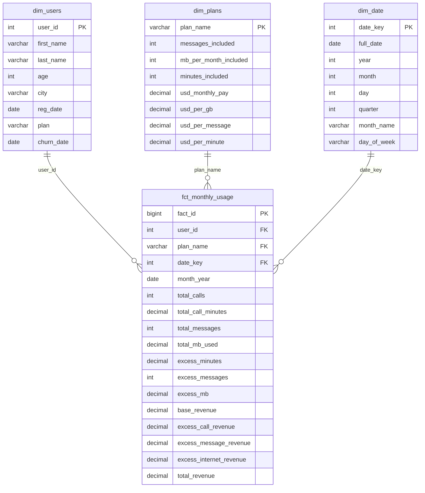

# Diagrama ERD — Capa Gold (Esquema Estrella)

## Modelo Dimensional — Megaline Telecom

Este diagrama representa el modelado dimensional en esquema estrella para la capa Gold del Data Warehouse de Megaline. La **tabla de hechos unifica los tres servicios** (llamadas, mensajes e internet) a nivel de usuario por mes.

## Descripción de las Tablas

### Tabla de Hechos: `fct_monthly_usage`

Tabla de hechos central que **unifica los tres servicios** (llamadas, mensajes e internet) a nivel de **usuario por mes**. Contiene métricas de uso y cálculos de ingresos.

| Columna | Tipo | Descripción |
|---------|------|-------------|
| `fact_id` | BIGINT | Clave surrogate de la tabla de hechos |
| `user_id` | INT | FK → dim_users |
| `plan_name` | VARCHAR | FK → dim_plans |
| `date_key` | INT | FK → dim_date (primer día del mes) |
| `month_year` | DATE | Mes/año del período |
| `total_calls` | INT | Total de llamadas realizadas en el mes |
| `total_call_minutes` | DECIMAL | Total de minutos de llamadas |
| `total_messages` | INT | Total de mensajes SMS enviados |
| `total_mb_used` | DECIMAL | Total de MB consumidos de internet |
| `excess_minutes` | DECIMAL | Minutos que exceden el plan |
| `excess_messages` | INT | Mensajes que exceden el plan |
| `excess_mb` | DECIMAL | MB que exceden el plan |
| `base_revenue` | DECIMAL | Ingreso base (cuota mensual del plan) |
| `excess_call_revenue` | DECIMAL | Ingreso por minutos excedentes |
| `excess_message_revenue` | DECIMAL | Ingreso por mensajes excedentes |
| `excess_internet_revenue` | DECIMAL | Ingreso por GB excedentes |
| `total_revenue` | DECIMAL | Ingreso total = base + excedentes |

### Dimensión: `dim_users`

Catálogo de usuarios/clientes de Megaline.

### Dimensión: `dim_plans`

Catálogo de planes con cuotas mensuales, límites incluidos y tarifas por excedente.

### Dimensión: `dim_date`

Dimensión de fecha para facilitar análisis temporales (filtrar por año, mes, trimestre, etc.).

## Granularidad

- **Grano:** Un registro por **usuario por mes**
- **Unificación:** Los tres servicios (calls, messages, internet) se agregan en una sola fila por usuario/mes
- **Cálculo de excedentes:** Se calculan comparando uso real vs. límites del plan
